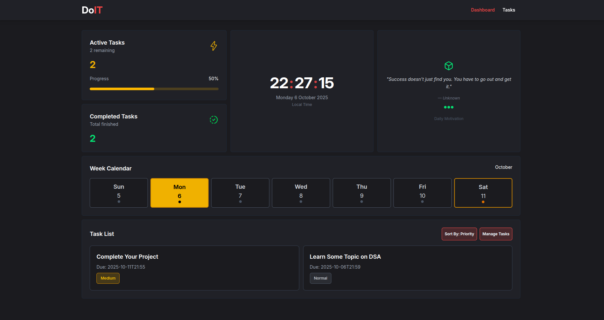

# DoIT - Todo App with Dashboard

A modern, feature-rich todo application built with React, offering more than basic task management with an interactive dashboard and productivity insights.

## 🚀 Live Demo

**[View DoIT Live](https://doit-evo.vercel.app/)**

## 🌟 Features

### Task Management

- **Create Tasks**: Add tasks with deadlines, descriptions, and priority levels
- **Priority Levels**: Organize tasks by High, Medium, and Normal priority
- **Date & Time**: Set specific deadlines for better time management
- **Active Tasks Section**: View and sort all pending tasks by priority
- **Completed Tasks**: Track finished tasks with bulk delete functionality

### Interactive Dashboard

- **Live Statistics**: Real-time display of active and completed task counts
- **Digital Clock**: Live clock with seconds using React hooks
- **Weekly Calendar**: Visual calendar with color-coded task indicators
- **Progress Tracking**: 50% completion rate display
- **Daily Motivation**: Random motivational quotes on each refresh

### User Experience

- **Responsive Design**: Works seamlessly across all device sizes
- **Modern UI**: Clean interface built with TailwindCSS and DaisyUI
- **Enhanced Interactions**: SweetAlert2 for better user feedback
- **Smooth Navigation**: React Router for seamless page transitions

## 🛠️ Tech Stack

- **Frontend Framework**: React 18
- **Routing**: React Router DOM
- **Styling**: TailwindCSS + DaisyUI
- **Alerts**: SweetAlert2
- **Deployment**: Vercel
- **Build Tool**: Vite

## 🎨 Key Technical Features

- **Custom React Hooks**: `useCurrentTime` for live clock updates
- **Context API**: Global state management for tasks across components
- **Local Storage**: Persistent data without backend dependency
- **Responsive Grid**: CSS Grid and Flexbox for perfect layouts
- **Date Handling**: Smart date comparisons and week calculations
- **Component Architecture**: Modular, reusable UI components

## 🎓 What I Built & Learned

This project demonstrates:

- **React State Management**: Context API, useState, useEffect patterns
- **Date/Time Logic**: Week calculations, timezone handling, real-time updates
- **Modern CSS**: TailwindCSS, responsive design, dark theme implementation
- **User Experience**: Loading states, animations, accessibility considerations
- **Project Structure**: Component organization, custom hooks, utility functions

## 📱 Browser Support

- Chrome 90+
- Firefox 88+
- Safari 14+
- Edge 90+
